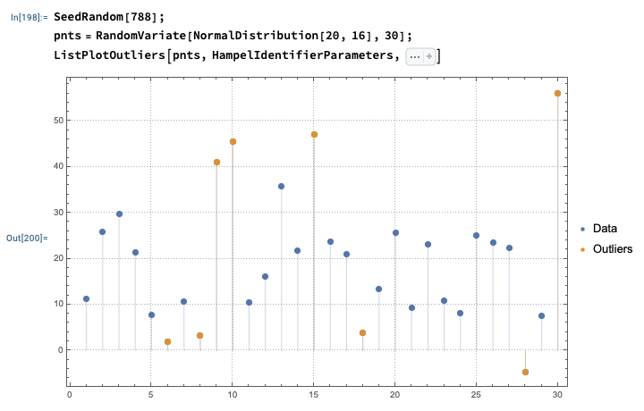

# OutlierIdentifiers WL paclet

Wolfram Language (aka Mathematica) paclet that provides outlier identifier functions.

The purpose of the outlier detection algorithms is to find those elements in a list of numbers that have values significantly higher or lower than the rest of the values.

Note that taking a certain number of elements with the highest values is not the same as an outlier detection, 
but it can be used as a replacement.

Here is example code:

```mathematica
SeedRandom[788];

pnts = RandomVariate[NormalDistribution[20, 16], 30];

ListPlotOutliers[pnts, HampelIdentifierParameters, 
  PlotRange -> All, Filling -> Axis, PlotRange -> All, 
  PlotTheme -> "Detailed", PlotLegends -> {"Data", "Outliers"}, ImageSize -> Large]
```




----- 

## References

[AA1] Anton Antonov,
["Outlier detection in a list of numbers"](https://mathematicaforprediction.wordpress.com/2013/10/16/outlier-detection-in-a-list-of-numbers/),
(2013),
[MathematicaForPrediction at WordPress](https://mathematicaforprediction.wordpress.com/).

[RP1] Ronald K. Pearson, 
"Mining Imperfect Data: Dealing with Contamination and Incomplete Records", 2005, SIAM.